# Visite guidée

Une revue du début à la fin, avec les fenêtres que vous verrez vraiment.
Les captures utilisent l'apparence sombre et le thème `default` ; le
dépôt en revue est un petit générateur de coups d'échecs, et la
relectrice est `ada`.

## L'écran d'accueil

Prchum s'ouvre sur l'écran d'accueil : quatre façons d'entrer en haut
et, dessous, les revues déjà ouvertes.

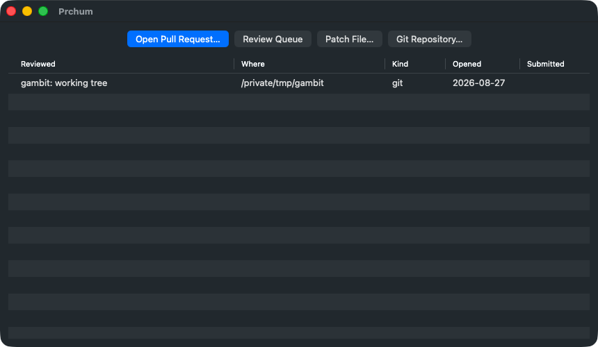

L'historique retient d'où venait chaque revue et si vous l'avez envoyée.
Les lignes des demandes fusionnées ou fermées depuis sont élaguées, et
avec elles les worktrees que prchum avait créés.

## La file de revue

⇧⌘L demande à votre forge quelles demandes vous attendent.

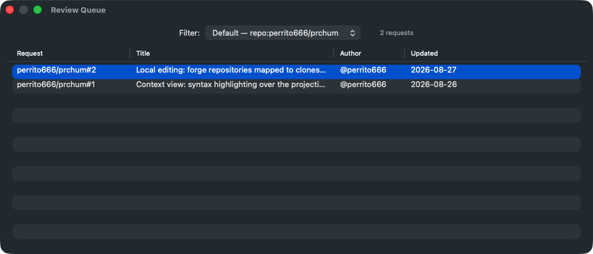

Le sélecteur en haut choisit le filtre. Les filtres nommés viennent de
la table `list_filters` de votre configuration, le filtre par défaut
s'exécute quand vous n'en choisissez aucun, et **Custom…** accepte un
filtre tapé sur le moment pour le reste de la session.

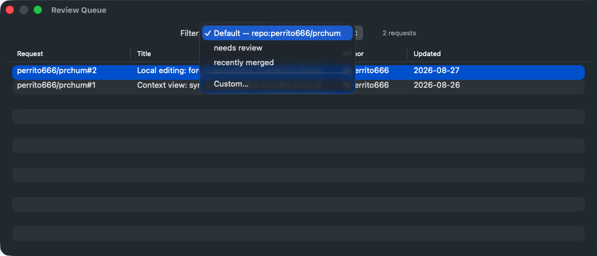

Return, ou un double clic, ouvre la demande sélectionnée.

## Lire un diff

La fenêtre de revue, c'est la barre latérale des fichiers modifiés, la
barre d'outils et le diff.

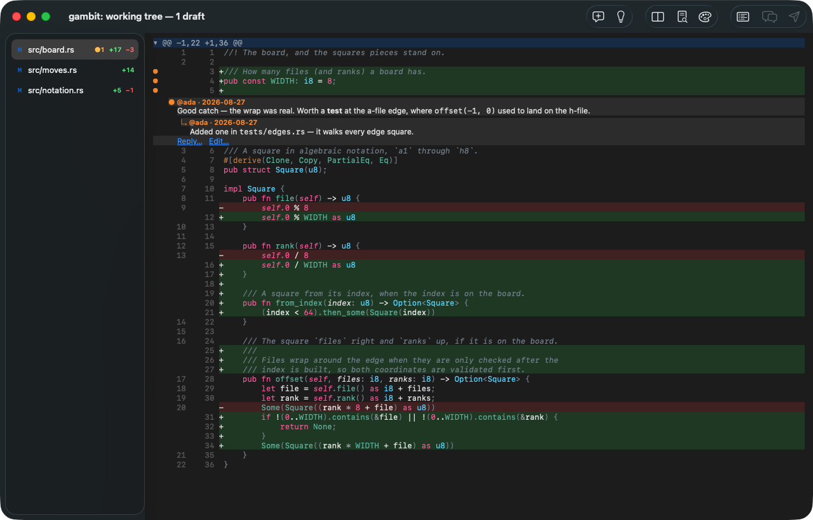

La barre latérale compte les ajouts et les suppressions par fichier, et
marque les fichiers porteurs de commentaires. ⌘↓ et ⌘↑ parcourent les
changements, ⌥⌘↓ et ⌥⌘↑ les hunks, ⇧⌘↓ et ⇧⌘↑ les fichiers. La
coloration syntaxique fait une passe tree-sitter par côté de chaque
hunk : une construction sur plusieurs lignes se colore correctement sur
l'ancien texte comme sur le nouveau.

Ouvrir une pull request donne la même chose — la barre de titre nomme la
demande au lieu de la comparaison.

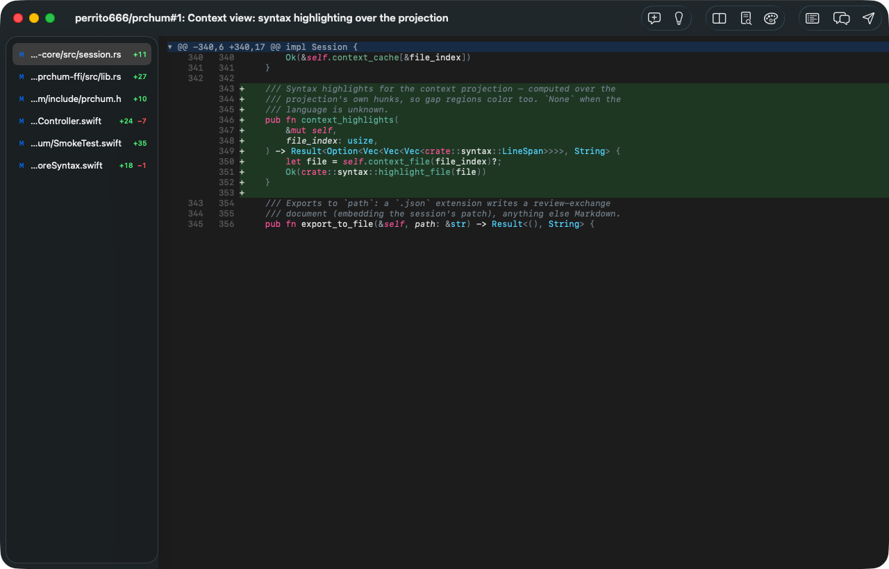

⌘I affiche la description de la demande, rendue en Markdown, avec la
branche cible et un bouton pour l'ouvrir dans un navigateur.

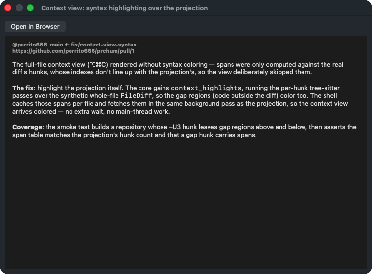

## Vue côte à côte

⌥⌘T place les deux côtés dans des panneaux parallèles. Le panneau où se
trouve le curseur décide du côté visé par un nouveau commentaire.

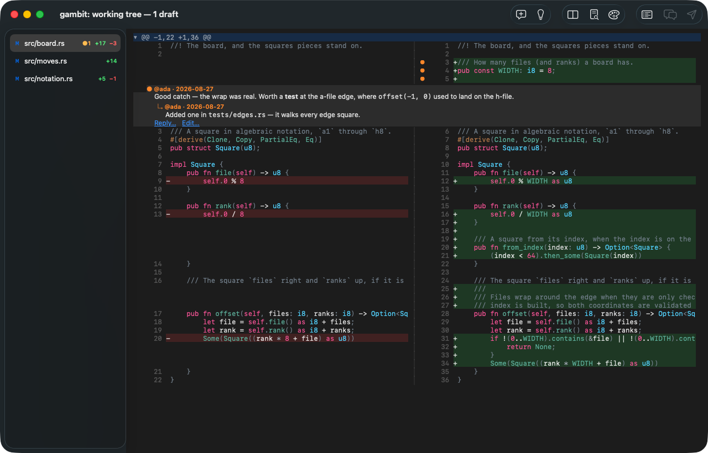

## Contexte du fichier entier

Un diff montre trois lignes autour de chaque changement, souvent trois
lignes de trop peu.

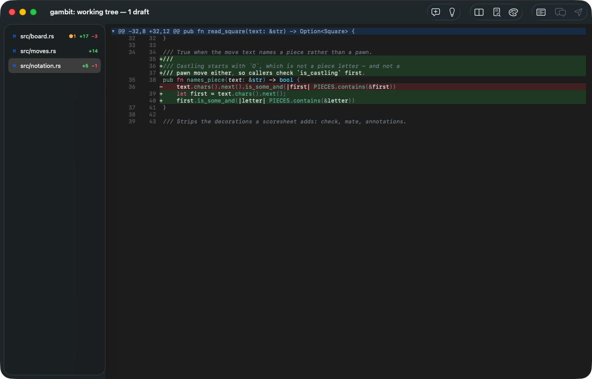

⌥⌘C récupère le fichier entier et y replace les hunks, pour que vous
lisiez le changement là où il vit. Le code hors du diff est coloré lui
aussi, et la récupération se fait hors du fil principal : la fenêtre
reste vivante pendant ce temps.

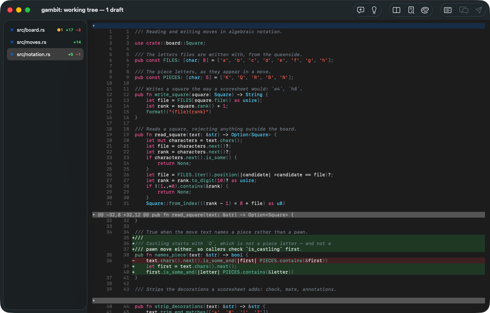

## Commenter

⌘↩ commente la ligne sous le curseur, ou la sélection.

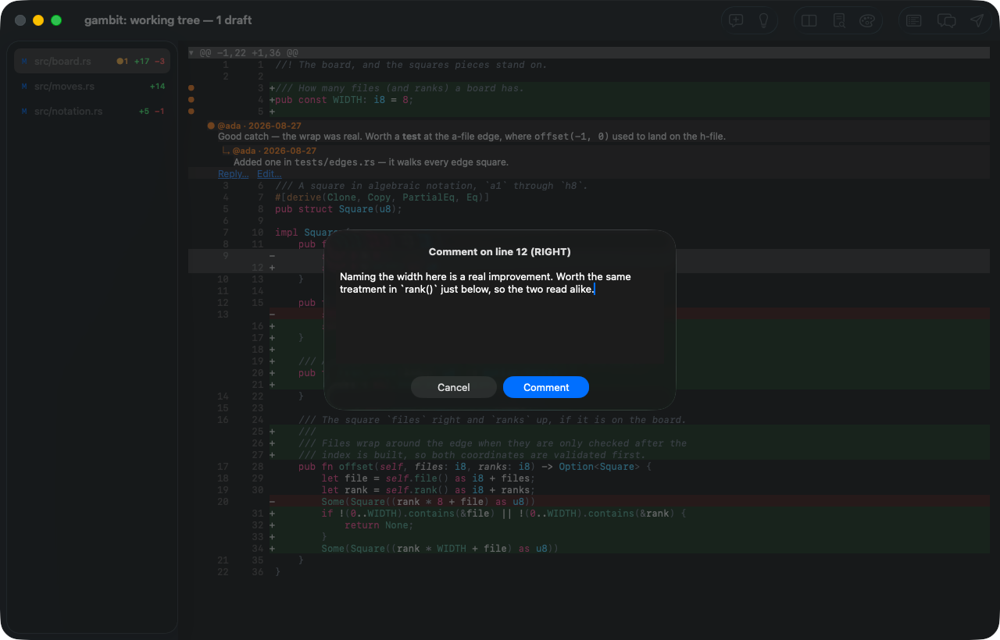

Une sélection sur plusieurs lignes devient un commentaire de plage,
telle que la forge la comprend.

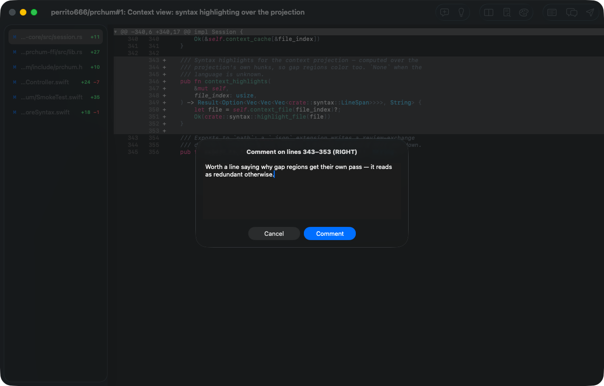

Les commentaires ne sont pas attachés à une ligne à l'écran. Ils
s'ancrent à un emplacement sémantique — fichier, côté, plage de lignes,
et une courte ancre de contexte avec une empreinte du contenu de la
ligne — et c'est pourquoi un brouillon survit au déplacement de la
branche sous lui.

Les brouillons et les fils déjà présents sur la demande apparaissent en
ligne, encadrés, leur Markdown rendu.

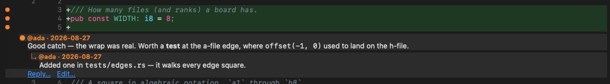

⌘R répond dans un fil, ⌘E modifie le brouillon sous le curseur, ⇧⌘X en
écarte un (gardé en local, jamais envoyé) et ⌘⌫ le supprime.

## Le navigateur de revue

⌘L liste tous les brouillons et fils de la revue ; Return saute à celui
que vous choisissez.

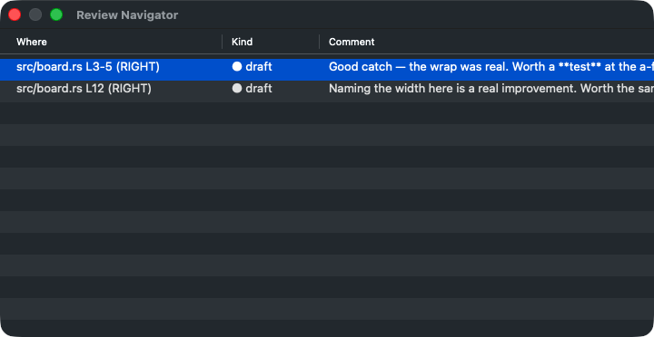

## Envoyer

⇧⌘↩ ouvre la feuille d'envoi : combien de commentaires et de réponses
vont partir, une zone pour le résumé de la revue, et l'événement —
commenter, approuver ou demander des changements. ⌥⌘A et ⌥⌘R ouvrent la
même feuille avec approuver ou demander des changements déjà choisi.

Les commentaires que la forge accepte quittent vos brouillons locaux au
fur et à mesure : un envoi qui échoue à mi-chemin se reprend sans rien
publier deux fois. Les brouillons orphelins — ceux dont le code a
disparu — ne sont jamais envoyés, et la feuille le dit avant que vous
vous engagiez.

## Réglages

⌘, garde ce qui vaut la peine d'être changé.

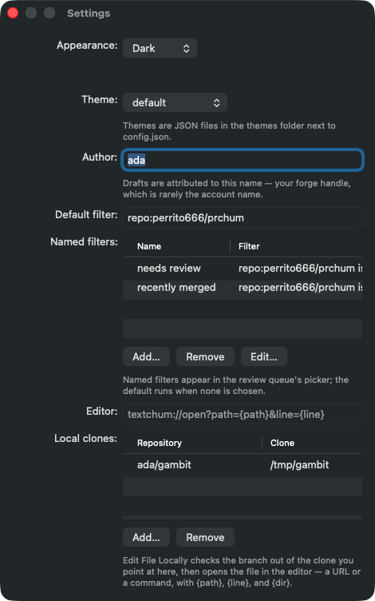

Apparence et thème ; le nom auquel vos brouillons sont attribués ; les
filtres de découverte, celui par défaut et les filtres nommés ; le
modèle d'éditeur ; et la table qui relie les dépôts de la forge à des
clones locaux, dont **Edit File Locally** (⌃⌘E) se sert pour sortir la
branche et ouvrir le fichier là où est votre curseur.

Tout cela est écrit dans `config.json`, qui reste modifiable à la main :
les clés inconnues survivent à chaque enregistrement, et un fichier que
prchum ne sait pas lire n'est jamais écrasé.
